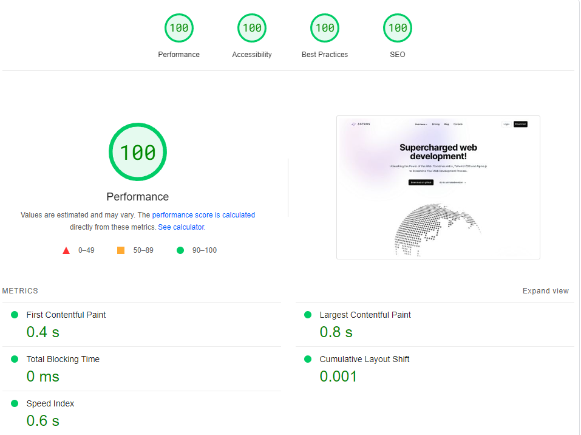

<a href="https://astros.warps.it">
  
</a>

# [Astros](https://astros.warps.it)

Astros is a template made with [Astro](https://astro.build), [Tailwind](https://tailwindcss.com/) and [AlpineJS](https://alpinejs.dev/).

This project is strongly inspired by [Astroships](https://github.com/surjithctly/astroship), [Flowbite](https://flowbite.com/blocks/) and [Tailwind UI](https://tailwindui.com/components) components, make sure to check them out as well!


[](https://deploy.workers.cloudflare.com/?url=https://github.com/warpsio/astros)

[](https://app.netlify.com/start/deploy?repository=https://github.com/warpsio/astros)

[](https://vercel.com/new/clone?repository-url=https://github.com/warpsio/astros)


### [🧑‍🚀 Astro website →](https://astro.build/)

### [🕮 Astro docs →](https://docs.astro.build/en/getting-started/)

---

## Preview




## 🧪 Test

On the folder run

1. `npm i`  <small>(or `yarn` or `pnpm i`)</small>
2. `npm run dev`  <small>(or `yarn dev` or `pnpm dev`)</small>

(if it's not working report an [issue](https://github.com/warpsio/astros/issues))

## 🚀 Deploy

### Cloudflare pages (suggested)

You can either click on the button above to deploy to Cloudflare automatically, or you can fork this repository and deploy manually from cloudflare dashboard.

You can leave build settings as defaults.

<details>
<summary>Work with modules in relink</summary>


</details>

### Netlify

### Vercel

### Others

You can check the deploy documentation at https://docs.astro.build/en/guides/deploy/

## 🧞 Dependencies

Astros depends on the following packages:

| Dependency                                                                             | Version        |
| -------------------------------------------------------------------------------------- | -------------- |
| [@astrojs/image](https://www.npmjs.com/package/@astrojs/image)                         | ^0.17.0        |
| [@astrojs/mdx](https://www.npmjs.com/package/@astrojs/mdx)                             | ^0.19.7        |
| [@astrojs/rss](https://www.npmjs.com/package/@astrojs/rss)                             | ^2.4.3         |
| [@astrojs/sitemap](https://www.npmjs.com/package/@astrojs/sitemap)                     | ^1.3.3         |
| [@astrojs/tailwind](https://www.npmjs.com/package/@astrojs/tailwind)                   | ^3.1.3         |
| [@fontsource-variable/inter](https://www.npmjs.com/package/@fontsource-variable/inter) | ^5.0.2         |
| [astro](https://www.npmjs.com/package/astro)                                           | ^2.6.1         |
| [astro-i18next](https://www.npmjs.com/package/astro-i18next)                           | ^1.0.0-beta.21 |
| [astro-icon](https://www.npmjs.com/package/astro-icon)                                 | ^0.8.1         |
| [astro-netlify-cms](https://www.npmjs.com/package/astro-netlify-cms)                   | ^0.5.3         |
| [astro-seo](https://www.npmjs.com/package/astro-seo)                                   | ^0.7.4         |
| [bad-words](https://www.npmjs.com/package/bad-words)                                   | ^3.0.4         |
| [dotenv](https://www.npmjs.com/package/dotenv)                                         | ^16.1.4        |
| [openai](https://www.npmjs.com/package/openai)                                         | ^3.2.1         |
| [rehype-autolink-headings](https://www.npmjs.com/package/rehype-autolink-headings)     | ^6.1.1         |
| [rehype-slug](https://www.npmjs.com/package/rehype-slug)                               | ^5.1.0         |
| [rss-parser](https://www.npmjs.com/package/rss-parser)                                 | ^3.13.0        |
| [tailwindcss](https://www.npmjs.com/package/tailwindcss)                               | ^3.3.2         |

## FAQ

<details>
  <summary>Work with modules in relink</summary>
  
  This is helpful if you want to apply some changes to various modules while you are working on the website.

To do so you have to go into each module and run

```
npm link
```
</details>

<br/>

---

<p align="right"><a href="https://warps.it/" target="_blank">warps.it</p>
